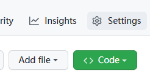
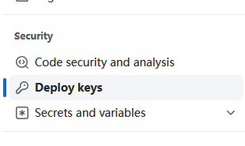
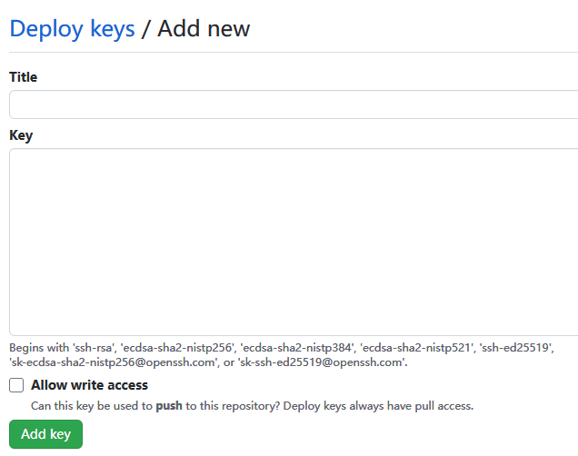

<div align=center>

# GitHub倉庫與連結 #

</div>

> GitHub的首頁

```
https://github.com/
```

## 來到首頁之後選擇`Sign UP`創建帳號


<br>

## 帳號辦理完成來到該介面選擇`New repository`創建存儲庫


<br>

## 接著設置

+ `設定存儲庫名稱`


+ `設定公開項目還是私有`


+ `最後創建即可`


<br>

## 如果已經設置好連結資料夾,再需上傳資料夾輸入
```
git remote add origin https://github.com/GitHub_ID/存儲庫名稱.git
```
### 之後可以直接再GitHub上進行修改,然後commit就好了

+ `查看分支`
```
git branch -a
```
+ `本地端要同步新修改就直接輸入`
```
git pull
```
```
git push origin
```

+ `本地端提交更新`
```
git commit -a -m "更新註解"
```

<br><hr><br>

## 與Vs code的連結設置
`之後補充...`


<br><hr><br>

## 小組倉庫創建ssh

+ `首先在下載下來的文件路徑開啟cmd,然後輸入`
```
ssh-keygen -t rsa -b 4096 -C "your name"
```

+ `接著一直按Enter直到出現`
<pre>
The key fingerprint is:
SHA256:************************** your@gmail.com or name
The key's randomart image is:
+---[RSA 4096]----+
|                 |
|                 |
|      o          |
|     . = . .     |
|      . S.=      |
|       =+O o   .o|
|   + ..+=oO o. oo|
|  o +.oEo=oBo.. .|
| ..+o  +=++.oo...|
+----[SHA256]-----+
</pre>

+ `**號這邊正常就是你的密鑰,當然不會是這符號`
<pre>
之後到使用者路徑
例如: C:/Users/user/.ssh/id_rsa.pub

找到這個id_rsa.pub
然後使用CMD執行命令

clip < id_rsa.pub

將該密鑰複製出來
</pre>

+ `接著到要設置的存儲庫,選擇設定`




+ `找到左側欄的Deploy keys`



+ `最後將剛剛複製的Key貼上,並且輸入個標題,之後添加即可`



+ `再次開啟CMD輸入,即可完整永久添加完畢`
```
ssh -T git@github.com
```
<hr>